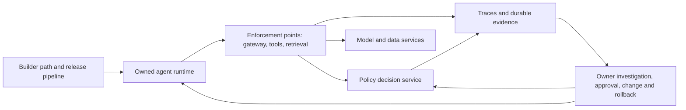

# Zentinelle through BROCS

Review date: 2026-09-10, America/Costa_Rica. Status: historical assessment of the baseline below. Remediation is documented in [the implementation record](2026-09-10-remediation.md); this document preserves the original evidence.

**Recommendation: make enforcement and its evidence dependable before expanding the feature catalogue.** Zentinelle has substantial building blocks: policy evaluators, a gateway, framework integrations, policy history and simulation, incidents, audit chaining, retention controls, and exports. Several connections between those components currently fail. A configured policy can appear active while the request bypasses its evaluator.

The best product direction is **a governance service that can explain and prove what each agent was allowed to do**, with a dependable enforcement path and useful operational evidence. Its center of responsibility under BROCS is Secure, with substantial Control and Observe capabilities. Build and Run need explicit integration contracts and owners.

## Scope and evidence

Reviewed the product monorepo at `2ef725faa6ea2f22f0854a612f01dfe835a57f5e`, including its existing working-tree changes; SDK checkout at `404c20aec637004dc6bf81bd9fff727641caedf9`; embedded SDK pin at `7c862568b8802c0538d589bce11d2add30ec0886`; and BROCS source at `8549a108c5a19bb70682061b3a7bb04eecdf3b24`. The product had 20 modified files before this review. Those changes were preserved.

Read the live [BROCS corpus](https://brocs.fyi/llms-full.txt) through HTTPS and the local framework sources. Applied BROCS 1.3, including the 25-statement assessment. The [method](https://brocs.fyi/resources/method/) treats scores as evidence of operating coverage within a defined scope; it provides neither certification nor a maturity ranking. This is a code and architecture assessment, so assigning an organization-wide `B/R/O/C/S` score would overstate the available evidence.

Evidence labels below:

- **Reproduced:** observed with local code, dummy credentials, local HTTP stubs, or mocked persistence. These probes do not establish exposure of a deployed installation.
- **Source-confirmed:** the relevant path is present in the reviewed code, but an entire deployed workflow was not exercised.
- **Proposed:** a product or engineering improvement, not a claim that an incident occurred.

Coverage included REST, GraphQL auth helpers, OIDC, policy evaluation, both proxies, selected SDK integrations, audit/retention/reporting, frontend auth and navigation, CI, and deployment manifests. No production penetration test, rendered browser walkthrough, complete dependency vulnerability inventory, or real cluster enforcement/restore drill was performed. Managed deployment wiring and every SDK language/plugin were not exhaustively reviewed.

## Product boundary under BROCS

| Capability | Useful foundation | Most valuable improvement | Ownership boundary |
|---|---|---|---|
| **Build** | SDKs, framework adapters, registration, provider integration | A verified onboarding path: register, deny a test action, trace it, revoke access. Publish which adapter actually enforces each control. | Workbench or another developer platform owns environments; Zentinelle owns the governance contract and integration checks. |
| **Run** | Compose, Kubernetes policies, cloud Terraform, health checks | Supported deployment profiles, trustworthy outage behavior, bounded queues, workload identity, load and restore evidence | Astrolift or another runtime owns execution and isolation. Zentinelle must verify the enforcement assumptions it depends on. |
| **Observe** | Events, interactions, usage, alerts, incidents, gateway metrics | A trace spanning user, agent, retrieval, model, tools, approval, outcome and policy version; visible missing telemetry | Integrate with existing tracing and paging. Governance-specific evidence belongs in Zentinelle. |
| **Control** | Policy history, effective-policy UI, simulation, model/provider configuration | Reviewed policy bundles, reliable replay, staged rollout, rollback, configuration acknowledgements, independent stop/revoke actions | Own agent/model policy and configuration; consume ingress, identity and recovery services through explicit interfaces. |
| **Secure** | Tool and model controls, scanning, budgets, approvals, audit chain, retention/legal holds | Prove interception, authorize each action, enforce scoped authority, preserve trustworthy evidence and privacy | This is the core product responsibility. Compliance framework mappings remain mappings, with explicit evidence gaps. |

This interpretation follows [BROCS governance](https://brocs.fyi/secure/governance/), [agent oversight](https://brocs.fyi/secure/agents/), [traces](https://brocs.fyi/observe/traces/), and the [worked example](https://brocs.fyi/resources/worked-example/). It is a product assessment using the framework, not a BROCS endorsement.

## Findings that should shape the next release

P0 means an enforcement release blocker in an affected configuration. P1 means a material security, data-integrity, or functional gap. These are implementation priorities, not CVSS scores.

### F01 · P0 · Gateway authentication failures can become provider access

**Reproduced.** [Gateway policy checks](../../gateway/policy.go) send `agent_id: ""`; [EvaluateRequestSerializer](../../backend/zentinelle/api/serializers.py) rejects blank IDs, and [EvaluateView](../../backend/zentinelle/api/views/evaluate.py) also requires the ID to match the authenticated endpoint. Meanwhile, every non-200 response enters the same fail-open fallback. [Gateway defaults](../../gateway/config.go) and [Compose](../../docker-compose.yml) enable fail-open.

A local HTTP test returned 401 for an invalid agent key. The [gateway handler](../../gateway/handler.go) still sent the request to a local provider stub using the gateway's provider credential. Separate probes confirmed 400, 401, 403, 429 and 500 all become `allowed=true`, with `output_filter_required=false`.

The Kubernetes manifest explicitly sets fail-open false. In that profile the blank-ID mismatch prevents valid traffic instead of permitting rejected traffic. Changing the default alone does not repair the request contract.

**Fix:** separate authentication/authorization failures from transient unavailability; derive identity from the validated key or send a validated canonical agent ID; fail closed by default; make any availability exception explicit, narrow and observable. **Acceptance:** a real gateway-to-Django test proves valid traffic works, invalid/revoked keys never reach upstream, 4xx responses never authorize execution, and outage behavior is tested independently.

### F02 · P0 · Proxy content does not reach the intended filters

**Reproduced at the evaluator boundary, source-confirmed in both callers.** [OutputFilterEvaluator](../../backend/zentinelle/services/evaluators/output_filter.py) reads `output_text`. Both [Go CheckOutputPolicy](../../gateway/policy.go) and the [Django proxy](../../backend/zentinelle/proxy/views.py) send `output`. The same blocked sentinel passes under `output` and is denied under `output_text`.

Input scanning has the same class of defect: [PromptInjectionEvaluator](../../backend/zentinelle/services/evaluators/prompt_injection.py) reads `input_text`, `tool_outputs`, and `rag_context`; Django supplies `extracted_text`, while Go's preflight supplies only provider/model. A known test phrase passes under the proxy field and fails under `input_text`. Separately, raw output with `block_pii` needs a real scan result; the raw-text branch only implements secret patterns and custom regex.

**Fix:** one versioned, typed evaluation envelope shared by callers and evaluators, including required context per control. Missing inspection inputs must produce an explicit unsupported/error result when enforcement requires them. Django's output-check exception handlers also need deliberate failure behavior. **Acceptance:** text, streaming, tool-result and retrieval fixtures traverse each supported integration; blocked content never reaches the next trust boundary.

### F03 · P1 · Provider-key management lacks a server-side role boundary

**Reproduced with mocked persistence.** [Provider-key views](../../backend/zentinelle/api/views/llm_provider_keys.py) are plain Django views with no authentication or admin-role requirement and are CSRF-exempt. A viewer session reaches the key replacement operation for the standalone tenant. An anonymous request reaches creation under the empty tenant string. The latter is not evidence of anonymous replacement of another tenant's key; it demonstrates failure to reject a caller without a tenant.

[Incident REST mutations](../../backend/zentinelle/api/views/incidents.py) similarly accept any authenticated principal through `OpenOrAgentAuth`, without a mutation-role check. Some export endpoints intentionally accept agent keys with tenant-wide visibility, which needs explicit scopes and a documented policy.

**Fix:** common permission rules for human roles and agent/service scopes, required tenant resolution, and object-level authorization across REST, GraphQL and assistant tools. **Acceptance:** a role × operation × tenant matrix denies viewers key changes and incident mutations, denies missing tenants, and constrains each machine key to its intended data and actions.

### F04 · P1 · Session auth and request protection are inconsistent

**Reproduced/source-confirmed.** [Assistant views](../../backend/zentinelle/api/views/assistant.py) set `authentication_classes=[]`. A request carrying a middleware-authenticated session user becomes anonymous in DRF and receives 403 in local mode. The execute-tool path also lacks an operator/admin check once authentication is repaired, and trusts client-submitted action arguments as an approval.

[GraphQL routing](../../backend/config/urls.py) is explicitly CSRF-exempt. Session-authenticated REST writes require CSRF, but browser calls such as [logout](../../frontend/lib/auth/session.ts) and incident comments do not send the token. Production sets the CSRF cookie HttpOnly. [PermissionGuard](../../frontend/components/PermissionGuard.tsx) currently renders everything, and the session response exposes staff flags rather than the actual role/capability set. Rate-limiting middleware exists but is absent from the configured middleware list; login has no dedicated throttle here.

**Fix:** a single authenticated browser client, explicit CSRF token acquisition/renewal, server-side capabilities, login throttling, and capability-aware UI. Enable assistant mutations only after the same authorization checks and an auditable action-bound approval apply. **Acceptance:** local and SSO browser journeys work for each role; missing CSRF and unauthorized direct API calls fail predictably. CSRF exploitability in a particular browser/deployment still needs a browser test.

### F05 · P1 · OIDC role revocation and tenant identity need explicit semantics

**Reproduced/source-confirmed.** [OIDC provisioning](../../backend/zentinelle/auth/oidc.py) only calls `assign_role` for recognized role claims. Removing the role claim leaves previously assigned groups intact; an old admin group can therefore survive the next login. Provisioning uses email as the username when present, while the tenant claim is read only for logging. Session helpers resolve Django users to the fixed standalone tenant; internal admins deliberately have installation-wide access.

**Fix:** store identity by issuer and subject, define safe account linking, reconcile roles on every login including absent/unknown claims, and test role downgrade. Make standalone single-tenancy explicit; require actual memberships and tenant resolution for a shared managed console. Add JWKS refresh/rotation tests, required claim checks, and PKCE. **Acceptance:** role removal revokes privilege, different issuers cannot silently link accounts, and two managed tenants cannot cross the configured boundary. The existing single-tenant mode is not itself a cross-tenant vulnerability.

### F06 · P1 · Audit integrity omits the change being audited

**Reproduced.** [Audit hashing](../../backend/zentinelle/services/audit_chain.py) omits the [AuditLog `changes` field](../../backend/zentinelle/models/audit.py). Reversing an old/new policy change leaves the entry hash unchanged. IP address, user agent and key prefix are also outside the hash. Verification walks the records it finds and does not compare a full export to an independently trusted terminal checkpoint. The current [SIEM export](../../backend/zentinelle/api/views/audit_export.py) omits fields needed to reconstruct and verify the complete chain.

**Fix:** versioned canonical serialization of security-relevant fields, explicit sequence/gap checks, retention-aware checkpoints, and independently stored signed chain heads. Produce self-verifiable evidence exports. Preserve the distinction between hashed history and unverifiable legacy history. **Acceptance:** changed diffs, reordered/missing records and truncated exports are detected; concurrent writers and legitimate retention transitions remain verifiable.

### F07 · P1 · Two retention paths disagree about legal holds

**Source-confirmed.** [Scheduled tasks](../../backend/zentinelle/tasks/scheduled.py) include a policy-based retention job that checks active legal holds, plus `cleanup_old_events`, which deletes processed telemetry after 90 days and audit events after 365 days across tenants without consulting those holds or tenant retention requirements. Both are enabled in [the Beat schedule](../../backend/config/settings/base.py).

The policy-based job also anonymizes `ext_user_id` in place, although it is hashed, and deletes audit prefixes without creating a verifiable retention boundary. These operations conflict with the integrity guarantees above. Prompt content is stored by [interaction ingestion](../../backend/zentinelle/api/views/compliance.py) before asynchronous scanning, and [gateway interaction logging](../../gateway/interaction.go) is on by default.

**Fix:** one retention decision service for every store and cleanup path, including holds, minimum retention, archive/deletion outcomes and evidence checkpoints. Redact before durable storage where required; define content-capture profiles and access separately from metadata. **Acceptance:** an active hold survives every scheduled cleanup; released holds expire correctly; anonymization and deletion preserve the documented integrity guarantees; interaction/scan/analytics storage has tested coverage.

### F08 · P1 · Human approval is insufficiently bound to an action

**Reproduced/source-confirmed.** [HumanOversightEvaluator](../../backend/zentinelle/services/evaluators/human_oversight.py) approves low-cost actions before checking sensitive-data or external-call conditions. A low-cost sensitive operation therefore passes. [Tool approval tokens](../../backend/zentinelle/services/evaluators/tool_permission.py) default to 24-hour validity, can be replayed, and skip user comparison when the caller omits `user_id`; the local probe successfully reused a user-bound token twice with no request user. Tokens do not bind exact arguments or a workload/session identity.

**Fix:** durable approval records bound to tenant, principal, workload, action and argument digest, policy version, expiry and one-time consumption. Derive sensitivity and identity from trusted enforcement context. Evaluate independent approval conditions independently. **Acceptance:** argument substitution, omitted identity, replay and low-cost sensitive actions cannot bypass approval; timeout and cancellation are visible to the operator.

### F09 · P1 · Policy composition and simulation can mislead operators

**Reproduced/source-confirmed.** [Policy merging](../../backend/zentinelle/services/policy_engine.py) keeps one policy per type. A higher-priority organization policy survives a more-specific lower-priority endpoint policy despite the documented scope rule. `evaluate()` does not supply the sub-organization parameter supported by the lookup method, so the normal request path does not apply team scope through that parameter.

[Simulation](../../backend/zentinelle/services/policy_simulator.py) passes `event.event_type` as the action and does not unpack the canonical evaluation event's nested `payload.context`. Replaying a recorded `policy_evaluation_tool_call` with an explicitly denied tool reports a pass. Evaluator exceptions also increment `would_pass`.

**Fix:** specify scope/priority ordering, composition of independent rules and non-overridable organization constraints. Replay the same normalized action envelope and policy resolution used in production; count errors and unsupported inputs separately. **Acceptance:** all five scopes, multiple controls of one type, policy conflicts, denied historical actions and evaluator failures produce explainable, consistent results.

### F10 · P1 · Budget controls use incompatible definitions of spend

**Source-confirmed.** The [budget evaluator](../../backend/zentinelle/services/evaluators/budget_limit.py), demo seeds and assistant templates use `monthly_budget_usd`. The [engine's organization budget check](../../backend/zentinelle/services/policy_engine.py) reads `monthly_limit_usd`. The evaluator trusts caller-supplied `current_month_spend_usd`, defaulting to zero; the gateway does not provide an authoritative spend value. Gateway interaction records omit `estimated_cost_usd`, while the organization check totals that field in InteractionLog. Other usage reporting paths exist, but this check does not read their ledger.

**Fix:** one validated configuration schema and authoritative usage ledger with provider price/version provenance, idempotent accounting, and scoped reservations before execution. Reconcile estimated and actual charges and define maximum overshoot. **Acceptance:** the same budget works through every integration; fan-out and retries cannot multiply an allowance; team/endpoint limits do not accidentally become tenant-wide limits; missing pricing appears as unknown rather than free.

### F11 · P1 · Compliance coverage is not evidence that a control operates

**Reproduced.** [Control coverage reports](../../backend/zentinelle/services/report_generator.py) match policies by name and `enabled=True`, without verifying policy type/configuration or required enforcement. A same-name, wrong-type policy with enforcement disabled is reported as an active control in a mocked-query probe.

**Fix:** stable control IDs and explicit states such as planned, configured, operating, failed and unverified. Link each control to its enforcement point, owner, target scope, test, latest evidence, expiry and exception. **Acceptance:** configuration presence alone cannot produce an operating-control claim; a disabled control or failed test changes the report; a reader can retrieve the evidence behind every coverage statement.

### F12 · P0 · The documented Compose production command retains a debug admin bypass

**Reproduced.** The [README production command](../../README.md) prefixes Compose with `DJANGO_SETTINGS_MODULE=config.settings.prod`, but [Compose](../../docker-compose.yml) explicitly sets the backend and workers to `config.settings.dev`, with backend `DEBUG=true`. Rendering the Compose configuration under that exact host setting confirmed that development settings remain selected.

[GraphQL auth](../../backend/zentinelle/api/graphql_view.py) accepts any `Authorization: Session ...` value as the synthetic admin when auth mode is local/standalone and the raw `DEBUG` environment flag is true. The local probe promoted an anonymous caller to superuser even with Django `settings.DEBUG=False`, because this path checks the environment directly. This is a conditional auth bypass, not a claim that a deployed service currently exposes it.

**Fix:** remove the unvalidated Session-header bypass; provide separate, tested development and production deployment profiles; select settings and auth from one runtime configuration source; make unsafe profiles refuse production startup. **Acceptance:** the documented production command renders and boots production settings, and arbitrary Session headers never establish an identity under any profile.

## Functional and feature improvements

| Proposed work | User value and concrete result | Dependencies |
|---|---|---|
| **Verified onboarding and enforcement coverage** | Register an agent and prove one allow, one deny, one trace and one revoke. Show every workload as enforced, observation-only, unsupported or unknown, with the evidence date. Compare expected workload inventory with observed traffic. | F01–F04; runtime inventory and admission/egress integration |
| **A unified agent detail page** | Owner, identities, tools, models, data access, budget, effective policy version, last heartbeat, trace links and stop/revoke controls in one place | F03, F05, F09, F10 |
| **Policy change workflow** | Draft → validate → replay → review → stage → enforce, with rollback and endpoint/gateway acknowledgement. Extend the existing history/simulator rather than starting another editor. | F02, F08, F09 |
| **Incident investigation and containment** | From an alert, open the complete run, see what data and tools were touched, suspend the agent or disable one tool, obtain approval where required, then export the evidence | F03, F06–F08; trace propagation and owner routing |
| **Evidence-backed control coverage** | Adapt BROCS into an optional diagnostic view with scope, owner, test and evidence links. Export an honest report with unknowns and customer responsibilities visible. | F06, F07, F11; integrations for Build/Run evidence |
| **Cost governance** | Per-team/app/session showback, enforceable budgets, reservations, anomaly alerts and cost per completed task where a business outcome is available | F10; consistent usage/outcome events |
| **Model change assurance** | Approved model/region/provider routes, version pinning where supported, scheduled evaluation canaries and measured failover | Common route/config contract; eval runner integration |
| **Delegated tool and retrieval access** | A tool executes with the user's/task's scoped authority; retrieved documents are authorized before reaching the model. MCP/tool adapters expose the same permission and evidence contract. | F05, F08; runtime credential broker and data-system enforcement |

The present navigation has substantial separation between agents, policy tools, content rules, risk, alerts, notifications, incidents, monitoring and compliance reports. Organize the main operator journeys around **protect an agent**, **change a policy**, **investigate an incident**, and **produce evidence**. Keep specialized screens as drill-downs, with capability-aware actions and explicit unavailable/error states.

Framework adapters need a capability matrix. For example, the SDK's LangChain callback emits telemetry but does not call `evaluate`; separate guardrail/runnable classes exist. Installing the callback alone is not proof of tool interception. The reviewed Go gateway also has three static provider routes despite generic provider-key configuration; assistant model/provider support should not be presented as gateway routing coverage.

## Architecture and delivery improvements



The diagram is the proposed operating contract. The runtime and data systems must make interception unavoidable for the actions they claim to govern; a model proxy cannot enforce arbitrary database writes or tool side effects on its own.

- **One wire contract:** action, tenant/workload/delegated-user identity, tool/resource target, normalized content, trace/run IDs, policy version, decision, reason, obligations and evidence IDs. Prefer explicit allow/deny/approval-required/error outcomes over missing-context passes.
- **One tested enforcement contract across implementations:** keep Go and Django only if common conformance fixtures justify both. Avoid independent security semantics per proxy or language. Publish the tested backend/SDK/plugin version combinations and update the embedded SDK pin deliberately.
- **Bounded operational work:** separate policy decision latency from telemetry delivery, use bounded asynchronous queues and durable outbox/retry/dead-letter handling where loss is unacceptable, expose dropped/late events and queue age. The current gateway drops failed asynchronous interaction reports.
- **Runtime proof:** Kubernetes policies are useful foundations, but enrollment is label-based; unlabelled workloads remain outside coverage. The Cilium example also allows same-namespace peers. Add admission/inventory checks and bypass drills, review lateral routes and broad provider domain patterns, and preserve explicit limits of vanilla NetworkPolicy.
- **Protect credentials and data in transit:** use workload identity/short-lived credentials where the deployment supports it, validate control-plane transport, allowlist forwarded provider headers, scope provider routes/methods, and redact before persistence according to an explicit capture policy.
- **Measure before scaling:** establish decision latency, enforcement availability, decision-version propagation, telemetry loss/lag, revocation time and evidence export time. Exercise provider/control-plane outages and backup restore, including keys and all schemas. Existing production Terraform enables RDS encryption, backups and deletion protection; successful recovery still needs evidence.
- **Release gates:** real gateway/backend/SDK contracts, browser tests in local/SSO modes, role/tenant negative tests, generated schema checks, enforceable lockfiles, lint, dependency/container scanning and signed build provenance. Current CI runs backend tests, Go vet/tests and frontend build; it does not exercise the whole governance path. Its backend dependency install can fall back from a locked install to an unlocked one.

Defer additional prompt-building tools, broad provider expansion and a task-orchestration rewrite until the enforcement path and a validated operating installation supply evidence that those investments are necessary. Preserve the existing separation of standalone features and managed-only services.

## Recommended sequence and acceptance gates

| Order | Work package | Proposed accountable function | Gate to move on |
|---|---|---|---|
| **1. Trustworthy enforcement** | F01–F05 and F12: wire contract, content inputs, role/tenant/CSRF/session boundaries, identity reconciliation and production profiles | Backend + gateway + security | Real API-path allow/deny/revoke tests; authenticated browser flows; role/tenant negative tests; supported deployment profiles agree |
| **2. Trustworthy decisions and evidence** | F06–F11: audit/retention, action-bound approval, policy resolution/replay, budgets, report truthfulness | Governance backend + data | Tamper/hold/replay/concurrency fixtures pass; reports distinguish configured, operating and unverified controls |
| **3. First complete operator journey** | Verified onboarding, agent inventory/detail, trace-to-incident-to-containment, evidence export | Product/frontend + runtime integration | A fresh install supports one agent through the full journey, including an outage and attempted bypass |
| **4. Safe expansion** | Policy promotion/rollback, delegated tool/retrieval enforcement, model canaries, broader adapter/provider coverage | Platform + integrations | Every added integration passes the same conformance suite and publishes its coverage limits |

The first vertical slice should demonstrate: **install with real authentication → enroll a workload → allow a benign action → deny a prohibited model/tool action → request and consume an approval → reconstruct the run → revoke the workload → export verifiable evidence**. Use a supported model path plus one actual side-effecting tool behind an enforcement service. Make missing coverage visible throughout.

The strongest next milestone is a release that can prove this journey with a declared deployment profile and reproducible evidence. Additional feature counts are a weaker measure of progress.

## Validation record

| Check | Result | Limit |
|---|---|---|
| Existing Go gateway suite, `go test ./...` | Passed | Uses mocked control-plane responses; did not catch F01/F02 |
| Focused Django suite: evaluators, SDK/deployment contracts, tenant isolation, API views, proxy, audit chaining, simulation, retention and policy engine | **179 passed**, one teardown warning | Isolated PostgreSQL 16 container, in-memory task broker and cache; test configuration flattens DB routing, so production schema isolation and real queue delivery remain unverified |
| Python SDK, `tests/` | **71 passed** | Python 3.12, temporary dependency environment |
| TypeScript SDK, `npm test -- --run` | **38 passed** | Existing client tests |
| Go SDK, `go test ./...` | Passed | Existing SDK tests |
| Additional Python review probes | All observed-defect assertions reproduced | Mocked persistence; database connections forbidden during probes |
| Additional Go review probes | Reproduced fail-open on 400/401/403/429/500 and invalid-key access to a local provider stub | Dummy keys and loopback HTTP only |
| Compose production-command rendering | Backend/worker retained development settings | Configuration render, not a production deployment |
| Patch whitespace and artifact links | Checked | Documentation/probes only |

The backend teardown warning reported remaining sessions while deleting its temporary test database. The dedicated PostgreSQL container was subsequently stopped and removed. Initial database/broker setup issues were resolved for the completed focused run. No real provider was called by the enforcement probes.

Reproduction artifacts: [Python probes](2026-09-10-brocs-probes.py) and [Go probes](2026-09-10-gateway-probes_test.go). **These assert the observed defects, not the desired secure behavior.** After fixes, invert them into regression tests with appropriate integration coverage.

From the product repository root, run the Python probes with:

```sh
backend/.venv/bin/python docs/reviews/2026-09-10-brocs-probes.py
```

Run the Go probes in a temporary copy so the working gateway remains untouched:

```sh
python3 - <<'PY'
from pathlib import Path
import shutil, subprocess, tempfile
root = Path.cwd()
with tempfile.TemporaryDirectory(prefix='zentinelle-review-') as folder:
    target = Path(folder)
    for source in [*(root / 'gateway').glob('*.go'), root / 'gateway/go.mod']:
        shutil.copy2(source, target / source.name)
    shutil.copy2(root / 'docs/reviews/2026-09-10-gateway-probes_test.go',
                 target / 'review_test.go')
    subprocess.run(['go', 'test', '-run', 'TestReview', '-v', './...'],
                   cwd=target, check=True)
PY
```

Product source files were not changed. The review added this document and the two probe files only; no commit, push, deployment or external issue/comment was made.
